

 
 

# DarmixPet

**Tu compañero de tiempo de pantalla.**

Un asistente mágico que vive sobre tus apps, te cuida la atención
y te recuerda que la vida también pasa fuera de la pantalla.

 

 

[🌟 Características](#-características) ·
[🎭 Compañeros](#-tus-compañeros) ·
[🔐 Permisos](#-permisos-paso-a-paso) ·
[🚀 Instalación](#-instalación) ·
[🔒 Privacidad](#-privacidad)

---

## 🌟 Acerca de DarmixPet

**DarmixPet** es una app de bienestar digital para Android que te ayuda a
recuperar el control sobre el tiempo que pasas en tu teléfono. En lugar de
bloquearte con pantallas frías y avisos genéricos, pone a **una mascota
flotante** sobre tus apps: te acompaña, te habla, te recuerda respirar y
te avisa cuando es momento de parar.

Cuando el tiempo de una app vigilada se agota, tu compañero te lleva
suavemente al inicio con un mensaje cariñoso, y activa un periodo de
**enfriamiento** obligatorio antes de que puedas volver a usarla.

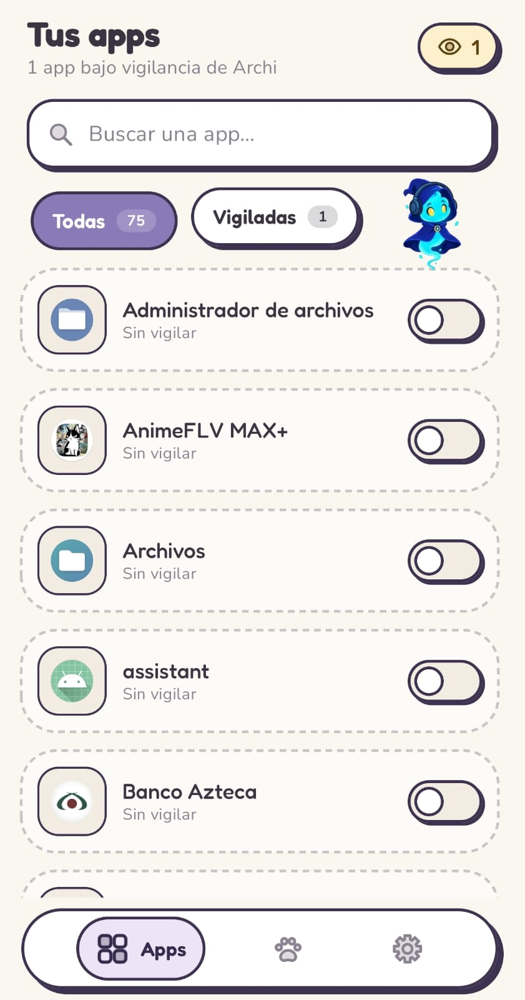
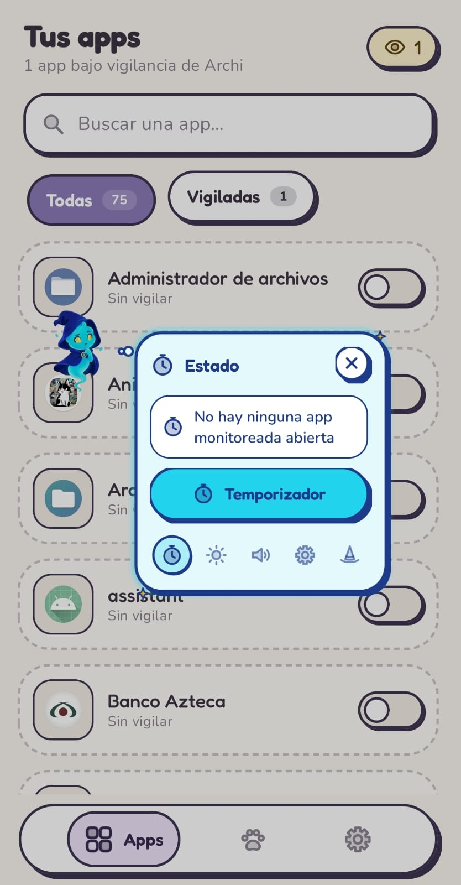
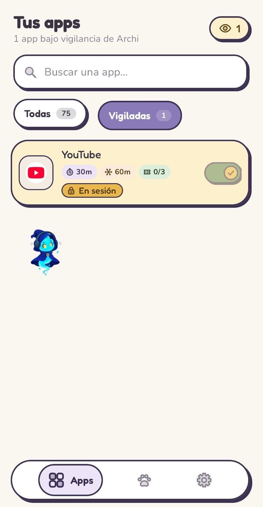

---

## ✨ Características

<table>
<tr>
<td width="50%" valign="top">

### 🎯 Vigilancia inteligente
Elige qué apps quieres vigilar, define **cuánto tiempo** puedes usarlas por
sesión, el **enfriamiento** entre sesiones y cuántas **sesiones al día**
tienes disponibles.

</td>
<td width="50%" valign="top">

### 🪄 Mascota flotante
Tres personajes con personalidad propia, sprites animados, frases
motivadoras y reacciones a tus gestos. Se arrastra a donde no estorbe.

</td>
</tr>
<tr>
<td width="50%" valign="top">

### ⚡ Menú rápido
Mantén presionada a tu mascota para abrir el menú: brillo, volumen,
temporizador, cambio de personaje y acceso directo a ajustes.

</td>
<td width="50%" valign="top">

### 🔋 Avisos contextuales
Se activa solo cuando tu batería está baja, cuando es muy tarde, o
cuando detecta que estás escuchando música.

</td>
</tr>
<tr>
<td width="50%" valign="top">

### 🎨 Diseño tipo sticker
Cada personaje trae su propia estética: contornos gruesos, sombras
sólidas desplazadas, tipografía redondeada (Fredoka + Nunito) y
paletas cuidadas.

</td>
<td width="50%" valign="top">

### 🌗 Tema claro / oscuro / sistema
Se adapta a tu gusto. La preferencia se guarda y se respeta entre
sesiones.

</td>
</tr>
</table>

---

## 🎭 Tus compañeros

Tres almas para tres formas de cuidarte. Elige la tuya desde la pantalla
**Mascota** y el splash, los avisos y el menú rápido cambiarán de estilo
contigo.

<table>
<tr>
<td align="center" width="33%">
 
<h3>Archi el Archimago</h3>
Éter · Magia Arcana  
<em>"Respira. Yo me encargo del ruido."</em>
</td>
<td align="center" width="33%">
 
<h3>Sylva el Sabio</h3>
Naturaleza · Vitalidad  
<em>"Todo lo bueno crece con calma."</em>
</td>
<td align="center" width="33%">
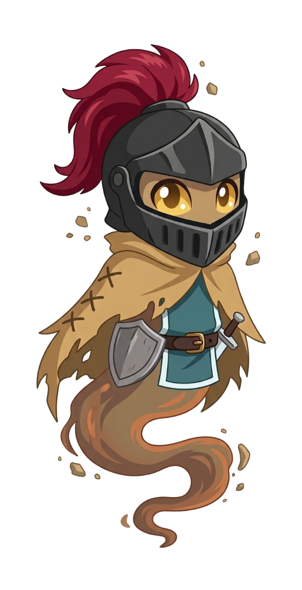 
<h3>Sir Galahad el Guardián</h3>
Tierra · Disciplina  
<em>"Tu tiempo es tu tesoro. Yo lo defiendo."</em>
</td>
</tr>
</table>

---

## 🎬 Cómo se ve

**Interacciones con la mascota**

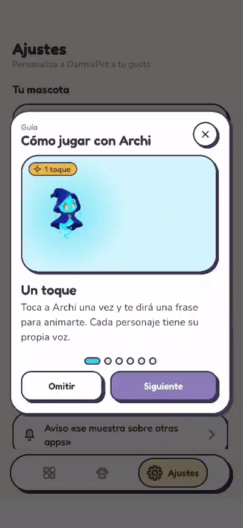
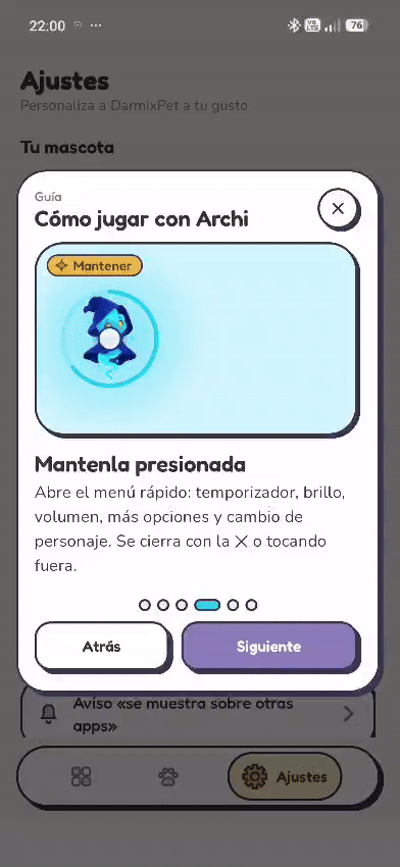

  

**Splash de bienvenida y bloqueo de app**

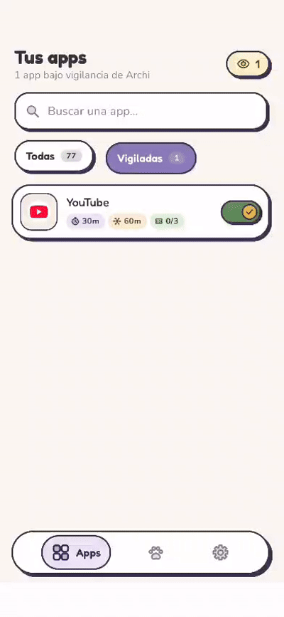

---

## 🚀 Instalación

### Requisitos

| Requisito | Valor |
|---|---|
| **Android** | 8.0 Oreo (API 26) o superior |
| **Arquitectura** | Universal |
| **Espacio** | ~15 MB |
| **Permisos** | 6 (ver abajo) |

### Pasos

1. Descarga el **APK** desde la [última release](../../releases/latest).
2. Ábrelo desde tu gestor de archivos.
3. Si Android lo pide, **autoriza la instalación desde esta fuente**.
4. Abre DarmixPet y **completa la pantalla de permisos** (abajo te explicamos cada uno).
5. Elige a tu compañero y empieza a cuidar tu tiempo.

> [!IMPORTANT]
> DarmixPet **no está en Google Play**. Se distribuye como APK directo
> desde este repositorio. Algunos permisos requieren un paso extra porque
> Android es más estricto con apps instaladas fuera de la tienda.

---

## 🔐 Permisos paso a paso

DarmixPet necesita 6 permisos para funcionar. La app te guía en cada uno
con instrucciones claras, pero aquí tienes el detalle para que sepas qué
esperar.

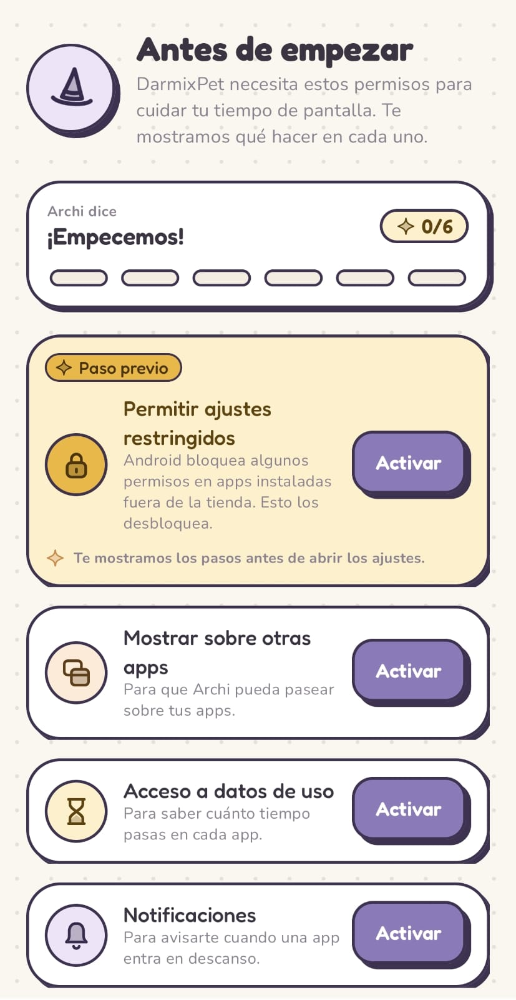

 

### 1️⃣ Permitir ajustes restringidos

> [!WARNING]
> **Solo aparece si instalaste desde fuera de Google Play y tienes Android 13+.**
> Es un paso **previo** que desbloquea los demás permisos.

| Paso | Acción |
|---|---|
| 1 | Se abrirá la pantalla **Información de la app** de DarmixPet |
| 2 | Toca el menú **⋮** (arriba a la derecha) y elige **Permitir ajustes restringidos** |
| 3 | Confirma con huella, PIN o patrón si te lo pide |
| 4 | Vuelve a DarmixPet y toca **"Ya lo hice"** |

💡 ¿No ves la opción?

Android a veces solo la muestra **después** de intentar activar un permiso
bloqueado. Prueba primero con **Acceso a datos de uso**: saldrá un aviso,
tócalo, acepta y regresa a la pantalla de información.

---

### 2️⃣ Mostrar sobre otras apps

Permite que tu mascota aparezca **flotando sobre el resto de apps**.

| Paso | Acción |
|---|---|
| 1 | Se abrirá la pantalla de DarmixPet |
| 2 | Activa **"Permitir mostrar sobre otras apps"** |
| 3 | Vuelve con el botón **Atrás** |

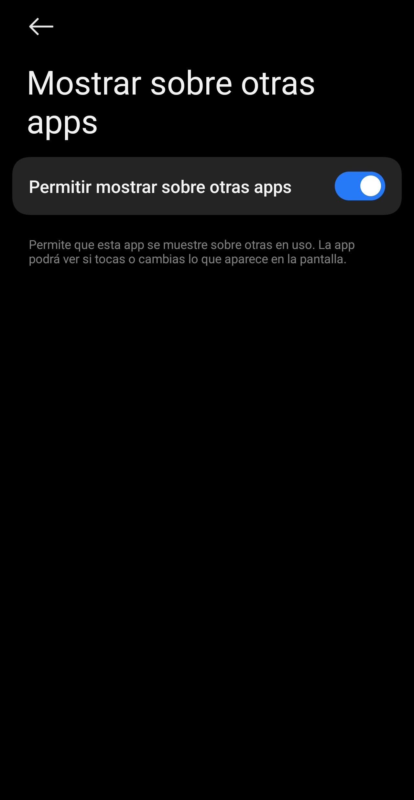

---

### 3️⃣ Acceso a datos de uso

Permite medir **cuánto tiempo pasas en cada app** para aplicar tus límites.

| Paso | Acción |
|---|---|
| 1 | Se abrirá la pantalla de DarmixPet. Si ves una lista, busca **DarmixPet** y tócalo |
| 2 | Activa **"Permitir acceso al uso"** |
| 3 | Si aparece un aviso de seguridad, léelo y acepta |
| 4 | Vuelve a DarmixPet |

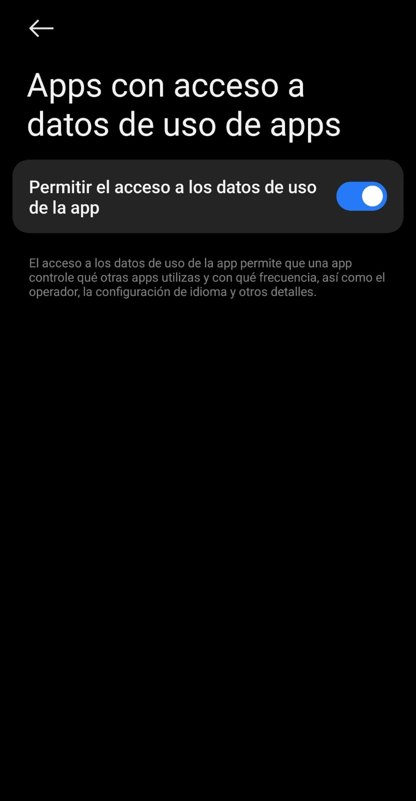

---

### 4️⃣ Notificaciones

Sirven para avisarte cuando una app entra en descanso y para mantener
viva a tu mascota en segundo plano.

- Si es la **primera vez**: Android muestra un diálogo. Toca **Permitir**.
- Si **rechazaste antes**: se abrirán los ajustes de notificaciones de DarmixPet. Activa **Permitir notificaciones** y vuelve.

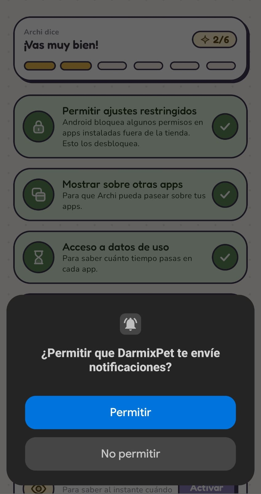

---

### 5️⃣ Ignorar optimización de batería

Para que tu mascota **no se cierre sola** por ahorro de energía.

| Paso | Acción |
|---|---|
| 1 | Se abrirá la configuración de batería de DarmixPet |
| 2 | Elige **Sin restricciones** (o **No optimizar** / **Permitir**) |
| 3 | Vuelve a DarmixPet |

💡 Nota para Xiaomi, Huawei y otras marcas

En algunos teléfonos conviene activar también **Inicio automático** para
DarmixPet desde los ajustes de la marca.

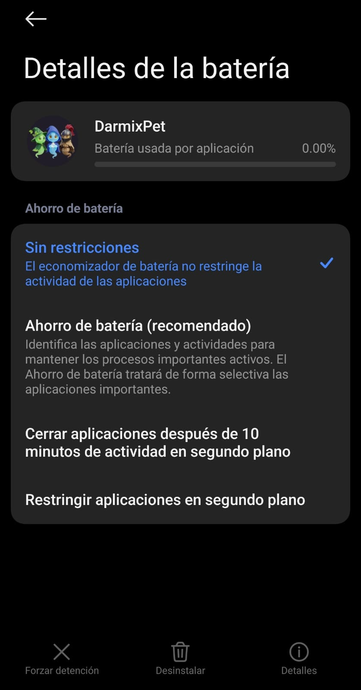

---

### 6️⃣ Detección instantánea (Accesibilidad)

Permite saber **al instante** cuándo abres una app vigilada, para
bloquearla a tiempo. DarmixPet **solo lo usa para detectar qué app está
abierta** — no lee mensajes, ni teclados, ni contraseñas.

| Paso | Acción |
|---|---|
| 1 | Se abrirá Accesibilidad |
| 2 | Entra a **Apps descargadas** (o **Servicios instalados**) y toca DarmixPet |
| 3 | Activa **Usar DarmixPet** |
| 4 | Acepta el aviso de seguridad de Android |
| 5 | Vuelve a DarmixPet |

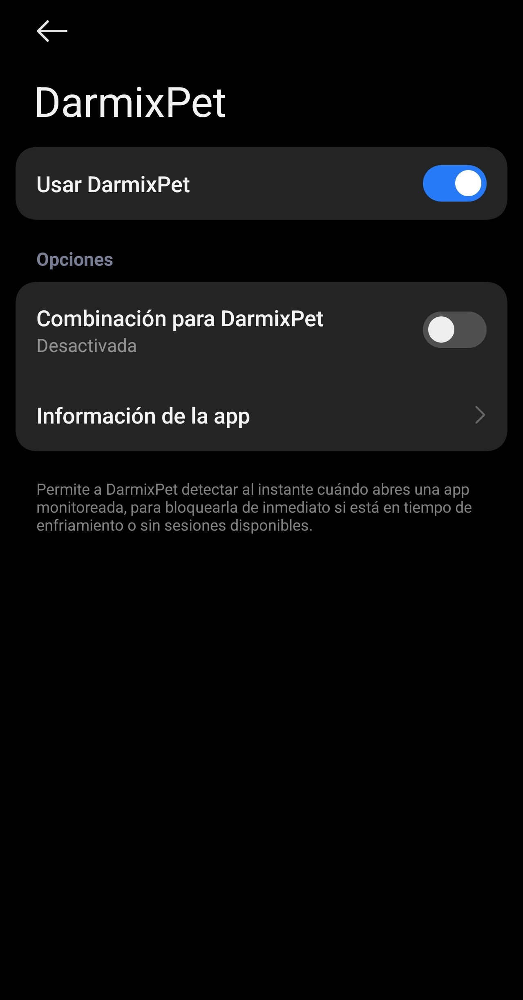

---

### 7️⃣ Modificar ajustes del sistema

Solo se usa para **ajustar el brillo** desde el menú rápido de la mascota.

| Paso | Acción |
|---|---|
| 1 | Se abrirá la pantalla de DarmixPet |
| 2 | Activa **"Permitir modificar los ajustes del sistema"** |
| 3 | Vuelve a DarmixPet |

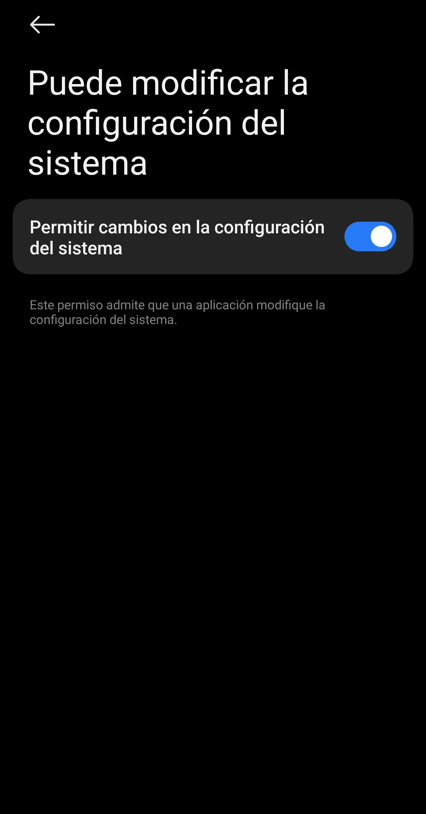

---

### ℹ️ Sobre el aviso "se muestra sobre otras apps"

> [!NOTE]
> Android muestra un aviso permanente **"DarmixPet se muestra sobre otras apps"**
> siempre que una app flota sobre el resto. **Lo pone el sistema**, no la
> aplicación, y no afecta al funcionamiento.

Si te molesta, puedes ocultarlo: mantén presionado el aviso → ⚙ → desactiva
la notificación **"mostrándose sobre otras apps"** (aparece bajo
*Android System*).

> [!CAUTION]
> **No desactives la notificación "DarmixPet activo"** — es la que mantiene
> viva a tu mascota en segundo plano.

---

## 🛠️ Stack técnico

<table>
<tr>
<td valign="top" width="50%">

**Lenguaje y UI**
- Kotlin `2.x`
- Jetpack Compose · Material 3
- Compose Canvas para íconos y animaciones
- Edge-to-edge · System bar styling

</td>
<td valign="top" width="50%">

**Arquitectura**
- `ComponentActivity` + Compose
- `LifecycleService` para el overlay
- `AccessibilityService` para detección instantánea
- Corrutinas + `Flow`

</td>
</tr>
<tr>
<td valign="top" width="50%">

**Persistencia**
- Room (SQLite) para apps vigiladas
- SharedPreferences para preferencias

</td>
<td valign="top" width="50%">

**Servicios del sistema**
- `UsageStatsManager`
- `WindowManager` (overlays)
- `AccessibilityManager`
- `TtsManager` para voz
- Notificaciones en primer plano

</td>
</tr>
</table>

---

## 🔒 Privacidad

**DarmixPet funciona 100% en tu teléfono.**

- ❌ No hay cuentas de usuario
- ❌ No hay anuncios
- ❌ No hay rastreo ni telemetría
- ❌ No hay servidores remotos
- ✅ Todo el procesamiento ocurre localmente
- ✅ Puedes borrar todos tus datos desinstalando la app

---

## 🐛 Reportar problemas y sugerencias

¿Encontraste un bug? ¿Se te ocurre una mejora? ¿Una frase nueva para
alguno de los personajes?

Abre un [**issue**](../../issues/new/choose) con:

- 📱 Modelo de teléfono y versión de Android
- 🎯 Versión de DarmixPet (visible en Ajustes → Acerca de)
- 📝 Descripción clara del problema o idea
- 📸 Captura o video si aplica

También puedes usar la plantilla de **Discussions** para ideas abiertas.

---

## 📄 Licencia

DarmixPet es un proyecto de **código cerrado y de uso personal**. Todos los
derechos reservados © 2025 Darmix.

La descarga y el uso personal de la aplicación están permitidos. No se
permite la redistribución, modificación o uso comercial sin autorización
expresa del autor.

---

**Hecho con 💜 por Darmix**

Si DarmixPet te ayuda a usar mejor tu tiempo, compártelo con quien lo necesite.

  

